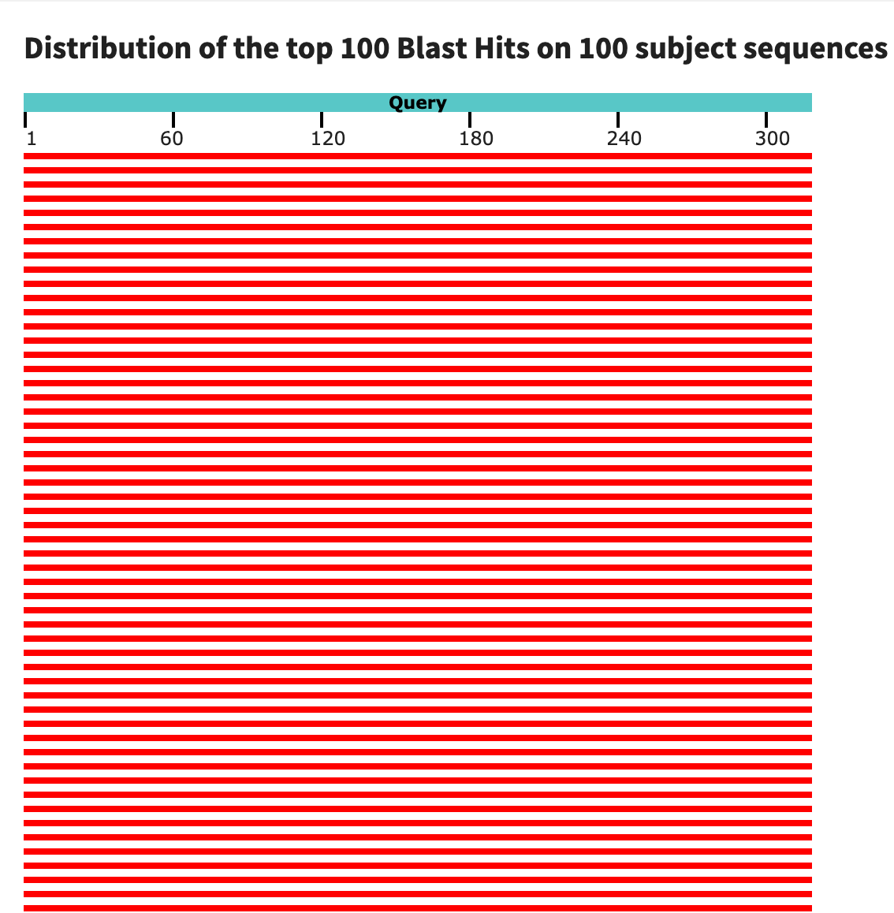
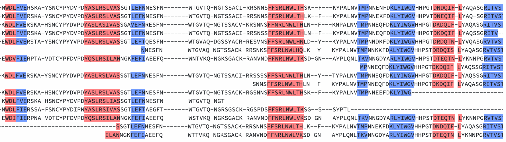

## **Task number 1**

# AF1505
This protein is the hemagglutinin from influenza A virus (A/Nebraska/AF1505/2008(H3N2)). After performing a blast, using protein blast, we visualized that the amino terminus of the protein is fine. We conclude this because the entire query, along the sequence, matched correctly with subject sequences.

Then, to study the prescence of secondary structures in this protein, we performed an Ali2D analysis using the **MPI Bioinformatics Toolkit**. We obtained that the protein contains 5 alpha helices.

#Importin subunit alpha from *Saccharomyces cerevisiae*
Using **EMBL-EBI**, this protein is conformed by the next domains:

- Importing Beta Binding domain
- 8 armadillo beta-catenin-like repeat
- Atypical arm repeat

This protein contains 8 repetitive armadillo beta-catenin-like motifs. However, we did not obtained any annotation respect to nucleat localization sequences (NLS).
Importin subunit alpha binds to substrates harbouring NLS, promoting the docking and importing to this substrates to nucleus.

#A4FWN1
This protein is the integral membrane sensor signal transduction histidine kinase from *Methanococcus maripaludis* and contains 4 domains:

- Single Cache domain 3
- HAMP domain
- Histidine kinase A domain
- Histinide kinase-DNA girase B-HSP90-like ATPase

##**Task number 2**

To perform an structure alignment, we studied globins from five different organisms:

- human
- horse
- sperm whale
- sea turtle
- tuna fish

