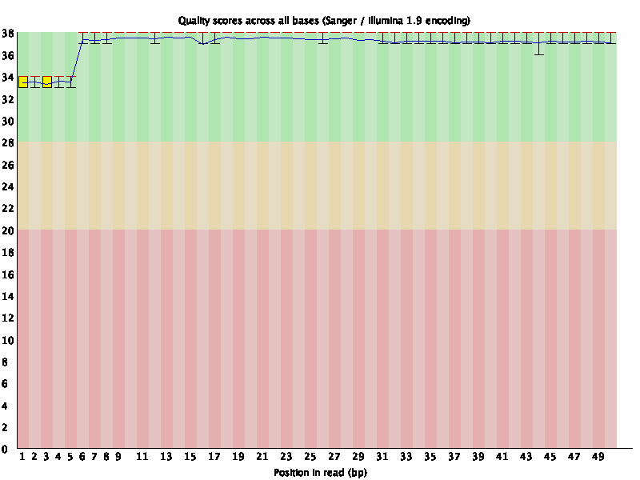
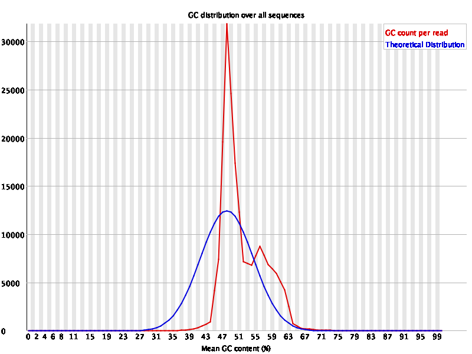
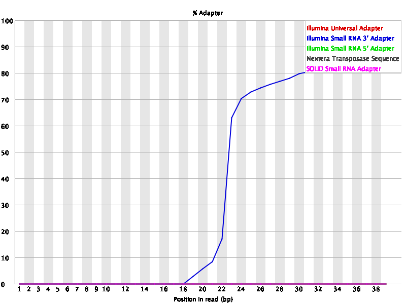

```{r setup, include=FALSE}
knitr::opts_chunk$set(echo = TRUE)
library(knitr)
library(ggplot2)
library(Biobase)
library(Biostrings)
library(gridExtra)
library(IRanges)
library(GenomicRanges)
library(rtracklayer)
library(Rsamtools)
library(GenomicAlignments)
library(dplyr)
```


## **Introduccion**

Los datos de secuenciación entregados para realizar esta práctica, provienen de un proyecto, en el cual se estudió el contenido molecular de vesículas secretadas por el nemátodo *Heligmosomoides bakeri* y el efecto de este contenido en células de epitelio intestinal de *Mus musculus*.

Para ello, se realizaron secuenciaciones de:

* Contenido de vesículas **(Pure_EV)**
* Células de ratón sin tratamiento **(MODEK_ctrl)**
* Células de ratón expuestas a las vesículas **(MODEK_EV)**

En un trabajo previo se demostró que el contenido las vesículas secretadas por el nemátodo está conformado por RNAs pequeños

## **Análisis de calidad de la secuencias**

Dentro de los flujos de trabajo de secuenciación, uno de los primeros pasos a ejecutar es el análisis de de la calidad de las lecturas secuenciadas. Para ello se utilizó el programa ```fastqc``` (v11.9) el cual reporta, de manera global, la calidad de las bases en cada una de las secuencias (expresada en escala phred), el tamaño de las lecturas en cada librería, el porcentaje de GC, la presencia de secuencias sobrerrepresentadas en la librería, entre otros parámetros.

A continuación, se realizó el análisis con ```fastqc``` en cada una de las muestras
```{bash engine.opts='-l', error = T, eval = F}
###Analyze quality of raw reads
##Run fastqc for every fq.gz file
fastqc -o fastqcoutput/ Data/*.fq.gz
```

En este análisis se observó que la calidad de las muestras fue óptima en cada una de las muestras.


Sin embargo, en las librerías **MODEK_EV** se observaron dos picos con respecto al % de GC, lo cual nos indica la posible presencia de secuencias con distinto origen.

Adicionalmente, en todas las muestras se detectó la presencia de adaptadores de Ilumina a partir de los nucleótidos 18 - 22 (tamaño aproximado de un RNA pequeño). Este resultado es debido a que el tamaño de las lecturas secuenciadas fue de 50 nt y del nc 18-22 al 50 se comenzaron a secuenciar los adaptadores.


Por ello fue necesario aplicar recorte o "trimming" de las secuencias de los adaptadores a las lecturas. Se empleó el programa ```reaper```(v16.098)
```{bash engine.opts='-l', error = T, eval = F}
###Cut the adapters in 3' end using Reaper
for i in Data/*.fq.gz; do
reaper -geom no-bc -3pa TGGAATTCTCGGGTGCCAAGG -i $i -basename $i 
done
```

Las bibliotecas procesadas por reaper, fueron analizadas nuevamente con ```fastqc``` para corroborar la ausencia de adaptadores.
```{bash engine.opts='-l', error = T, eval = F}
for i in Data/*lane.fq.gz; do
fastqc -o fastqcoutput/ $i
done
```
Se observó que el recorte fue exitoso ya que las bibliotecas limpias no presentaron adaptadores.


Posteriormente, los datos ```*lane.fq.gz``` generados se exportaron a R para realizar analizar la distribución de las lecturas de acuerdo a su tamaño y el contenido de bases en cada una.
```{r echo=F}
MODEK_ctrl_r1 <-  Biostrings::readDNAStringSet("Data/MODEK_ctrl_r1_100k.fq.gz.lane.fq.gz", format = "fastq")
MODEK_ctrl_r2 <-  Biostrings::readDNAStringSet("Data/MODEK_ctrl_r2_100k.fq.gz.lane.fq.gz", format = "fastq")
MODEK_ctrl_r3 <-  Biostrings::readDNAStringSet("Data/MODEK_ctrl_r3_100k.fq.gz.lane.fq.gz", format = "fastq")
MODEK_EV_r1 <-  Biostrings::readDNAStringSet("Data/MODEK_EV_r1_100k.fq.gz.lane.fq.gz", format = "fastq")
MODEK_EV_r2 <-  Biostrings::readDNAStringSet("Data/MODEK_EV_r2_100k.fq.gz.lane.fq.gz", format = "fastq")
Pure_EV_r1 <-  Biostrings::readDNAStringSet("Data/Pure_EV_r1_100k.fq.gz.lane.fq.gz", format = "fastq")
Pure_EV_r2 <-  Biostrings::readDNAStringSet("Data/Pure_EV_r2_100k.fq.gz.lane.fq.gz", format = "fastq")

width_nucleotideAnalysis <- function(reaper_biostring){
  
  a <- Biostrings::alphabetFrequency(reaper_biostring)
  a <- a[,1:4]
  b <- Biostrings::as.data.frame(reaper_biostring)
  first_nu <- substring(b$x,first = 1, last = 1)
  width <- reaper_biostring@ranges@width
  width <- data.frame(width)
  all <- cbind(width, a, first_nu)
  
  return(all)
}

barplot_first_nt <- function(reaper_df) {
  
  plotq <- ggplot(reaper_df, aes(width, fill=first_nu)) +
  geom_bar(color = "black") + theme_classic() +
  scale_fill_manual(values = c("darkcyan", "darkgreen", "darkgoldenrod", "darkred")) +
  labs(fill = "Base")
  return(plotq)
}

Ctrl_r1_data <- width_nucleotideAnalysis(MODEK_ctrl_r1)
Ctrl_r2_data <- width_nucleotideAnalysis(MODEK_ctrl_r2)
Ctrl_r3_data <- width_nucleotideAnalysis(MODEK_ctrl_r3)
EV_r1_data <- width_nucleotideAnalysis(MODEK_EV_r1)
EV_r2_data <- width_nucleotideAnalysis(MODEK_EV_r2)
PURE_r1_data <- width_nucleotideAnalysis(Pure_EV_r1)
PURE_r2_data <- width_nucleotideAnalysis(Pure_EV_r2)
```

Lo que se observa en estos gráficos es que la mayoría de las secuencias limpias tiene un tamaño cercano 20 nt. Sin embargo, la muestra MODEK_EV_r1 presentó un comportamiento distinto ya que se observaron dos picos debido a que la muestra se encuentra degradada. Asimismo, de acuerdo a la abundancia del primer nucleotido en cada una de las secuencias se observa que aquellas provenientes de las vesículas hay un mayor predominio de Guanina
```{r echo=F}
barplot_first_nt(Ctrl_r1_data) +
  ggtitle("MODEK_ctrl_r1")
barplot_first_nt(Ctrl_r2_data) +
  ggtitle("MODEK_ctrl_r2")
barplot_first_nt(Ctrl_r3_data) +
  ggtitle("MODEK_ctrl_r3")
barplot_first_nt(EV_r1_data) +
  ggtitle("MODEK_EV_r1")
barplot_first_nt(EV_r2_data) +
  ggtitle("MODEK_EV_r2")
barplot_first_nt(PURE_r1_data) +
  ggtitle("PURE_EV_r1")
barplot_first_nt(PURE_r2_data) +
  ggtitle("PURE_EV_r2")
```


